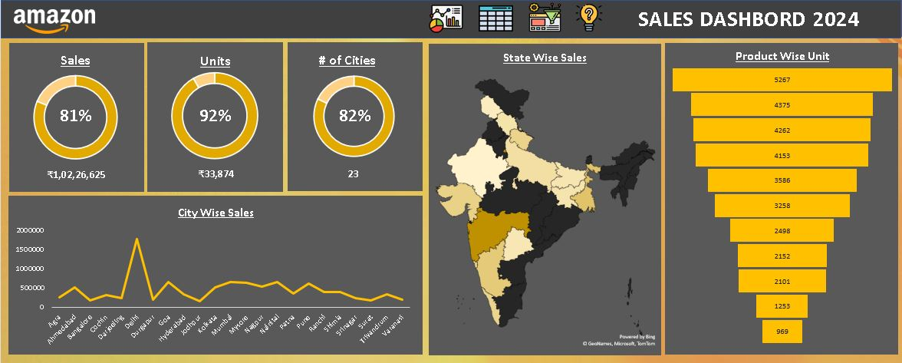

# Amazon Sales Dashboard in Excel

This project is an interactive Excel Dashboard built using over 10,000 rows of Amazon sales data.

## 🔍 Key Features:
- Product-wise sales analysis (funnel chart)
- State-wise sales heatmap (map chart)
- City-wise trend visualization (line chart)
- KPI Cards:
  - Total Sales: ₹1,02,26,625
  - Total Units: 33,874
  - Coverage: 23 cities

## 📸 Dashboard Preview

## 💡 Skills Applied:
- Advanced Excel (Pivot Tables, Charts, Dashboard Design)
- Data Cleaning & Visualization
- Business Insight Communication

## 📊 Relevance to Accounting & Finance:
- Useful for revenue tracking, forecasting, and reporting
- Helps in region-wise tax analysis (like GST)
- Supports data-driven budgeting and planning

---
